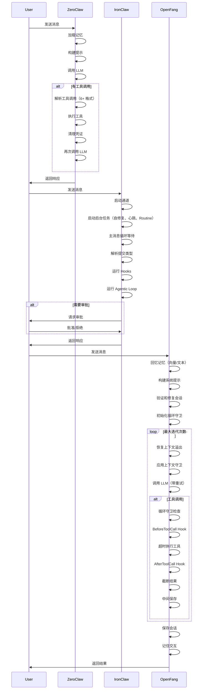

# Agent Loop 实现对比分析

本文档对比分析 ZeroClaw、IronClaw 和 OpenFang 三个 Rust Agent 框架的 Agent Loop 实现。

## 项目定位对比

| 特性 | ZeroClaw | IronClaw | OpenFang |
|------|----------|----------|----------|
| **定位** | 极简运行时 | 安全个人助手 | 自治 Agent OS |
| **核心理念** | 零开销、零妥协 | 安全优先 | 完全自治 |
| **目标硬件** | $10 硬件 | 标准服务器 | 标准服务器 |
| **内存占用** | <5MB | ~180MB | ~40MB |
| **启动时间** | <10ms | ~2.5s | <200ms |
| **二进制大小** | ~8.8MB | ~150MB | ~32MB |

## Agent Loop 架构对比

### 流程对比图

```mermaid
flowchart TB
    subgraph ZeroClaw["ZeroClaw Agent Loop"]
        ZC_Start([接收消息]) --> ZC_LoadMemory[加载记忆]
        ZC_LoadMemory --> ZC_BuildPrompt[构建提示]
        ZC_BuildPrompt --> ZC_FilterTools[过滤工具]
        ZC_FilterTools --> ZC_CallLLM[调用 LLM]
        ZC_CallLLM --> ZC_ParseResponse[解析响应]
        ZC_ParseResponse --> ZC_HasTools{工具调用?}
        ZC_HasTools -->|否| ZC_ExtractText[提取文本]
        ZC_HasTools -->|是| ZC_ExecuteTools[执行工具]
        ZC_ExecuteTools --> ZC_CallLLM
        ZC_ExtractText --> ZC_SaveHistory[保存历史]
        ZC_SaveHistory --> ZC_Return([返回响应])
    end
    
    subgraph IronClaw["IronClaw Agent Loop"]
        IC_Start([接收消息]) --> IC_StartChannels[启动通道]
        IC_StartChannels --> IC_SpawnBackground[启动后台任务]
        IC_SpawnBackground --> IC_MainLoop[主消息循环]
        IC_MainLoop --> IC_WaitMessage[等待消息]
        IC_WaitMessage --> IC_HandleMessage[处理消息]
        IC_HandleMessage --> IC_ParseSubmission[解析提交]
        IC_ParseSubmission --> IC_RouteMessage[路由消息]
        IC_RouteMessage --> IC_ProcessUserInput[处理用户输入]
        IC_ProcessUserInput --> IC_RunAgenticLoop[运行 Agent 循环]
        IC_RunAgenticLoop --> IC_CallLLM[调用 LLM]
        IC_CallLLM --> IC_ExecuteTools[执行工具]
        IC_ExecuteTools --> IC_CallLLM
        IC_CallLLM --> IC_SendResponse[发送响应]
        IC_SendResponse --> IC_WaitMessage
    end
    
    subgraph OpenFang["OpenFang Agent Loop"]
        OF_Start([接收消息]) --> OF_RecallMemory[回忆记忆]
        OF_RecallMemory --> OF_BuildPrompt[构建提示]
        OF_BuildPrompt --> OF_AddMessage[添加消息]
        OF_AddMessage --> OF_ValidateSession[验证会话]
        OF_ValidateSession --> OF_TrimHistory[修剪历史]
        OF_TrimHistory --> OF_InitGuard[初始化守卫]
        OF_InitGuard --> OF_LoopStart{迭代检查}
        OF_LoopStart --> OF_RecoverOverflow[恢复溢出]
        OF_RecoverOverflow --> OF_CallLLM[调用 LLM]
        OF_CallLLM --> OF_CheckReason{停止原因}
        OF_CheckReason -->|EndTurn| OF_ExtractText[提取文本]
        OF_CheckReason -->|ToolUse| OF_ExecuteTools[执行工具]
        OF_ExecuteTools --> OF_GuardCheck[守卫检查]
        OF_GuardCheck --> OF_ExecuteWithTimeout[超时执行]
        OF_ExecuteWithTimeout --> OF_TrimResult[截断结果]
        OF_TrimResult --> OF_LoopStart
        OF_ExtractText --> OF_SaveSession[保存会话]
        OF_SaveSession --> OF_Remember[记住交互]
        OF_Remember --> OF_Return([返回结果])
    end
```



## 核心差异

### 1. 消息接收方式

| 框架 | 方式 | 特点 |
|------|------|------|
| **ZeroClaw** | 直接函数调用 | 极简，无通道抽象 |
| **IronClaw** | 事件驱动循环 | 支持多通道，后台任务 |
| **OpenFang** | 内核调度 | 支持 Hands、定时任务 |

### 2. 工具调用解析

| 框架 | 支持格式 | 特色 |
|------|----------|------|
| **ZeroClaw** | 6+ 种格式 | XML、MiniMax、Perl、FunctionCall、GLM 等 |
| **IronClaw** | 标准格式 | OpenAI 原生、标准工具注册 |
| **OpenFang** | 标准 + 文本恢复 | 从文本中恢复工具调用 |

### 3. 安全机制

| 框架 | 安全特性 | 实现方式 |
|------|----------|----------|
| **ZeroClaw** | 凭证清理 | 正则表达式敏感信息过滤 |
| **IronClaw** | WASM 沙箱 | 完整的隔离执行环境 |
| **OpenFang** | 16 层防护 | 循环守卫、会话修复、审计跟踪 |

### 4. 错误处理

| 框架 | 重试机制 | 特点 |
|------|----------|------|
| **ZeroClaw** | 简单重试 | 基础错误处理 |
| **IronClaw** | 自动修复 | 检测卡住作业并修复 |
| **OpenFang** | 断路器 + 分类器 | 智能错误分类和重试 |

### 5. 后台任务

| 框架 | 支持 | 特点 |
|------|------|------|
| **ZeroClaw** | 无 | 纯 Agent Loop |
| **IronClaw** | 心跳 + 定时任务 + Routine 引擎 | 完整后台自动化 |
| **OpenFang** | Hands 系统 | 预构建自治能力包 |

## 关键代码对比

### ZeroClaw - 工具调用解析

```rust
// 支持多种 XML 格式
fn parse_xml_tool_calls(xml_content: &str) -> Option<Vec<ParsedToolCall>> {
    // 支持 <tool_call>、<toolcall>、<tool-call>、<invoke>、<minimax:tool_call> 等
    for (tool_name_str, inner_content) in extract_xml_pairs(trimmed) {
        // 解析嵌套参数标签或 JSON 参数
    }
}

// 支持 MiniMax XML 格式
fn parse_minimax_invoke_calls(response: &str) -> Option<(String, Vec<ParsedToolCall>)> {
    // <invoke name="shell"><parameter name="command">pwd</invoke>`
}
```

### IronClaw - 主消息循环

```rust
pub async fn run(self) -> Result<(), Error> {
    // 启动通道
    let mut message_stream = self.channels.start_all().await?;
    
    // 启动自修复任务
    let repair_handle = tokio::spawn(async move {
        loop {
            tokio::time::sleep(repair_interval).await;
            // 检测和修复卡住的作业
            let stuck_jobs = repair.detect_stuck_jobs().await;
            for job in stuck_jobs {
                let result = repair.repair_stuck_job(&job).await;
                // ... 处理结果
            }
            // 检测和修复损坏的工具
            let broken_tools = repair.detect_broken_tools().await;
            // ...
        }
    });
    
    // 主消息循环
    loop {
        let message = tokio::select! {
            biased;
            _ = tokio::signal::ctrl_c() => break,
            msg = message_stream.next() => {
                match msg {
                    Some(m) => m,
                    None => break,
                }
            }
        };
        
        // 处理消息
        match self.handle_message(&message).await {
            Ok(Some(response)) => {
                self.channels.respond(&message, OutgoingResponse::text(response)).await?;
            }
            Ok(None) => break,
            Err(e) => {
                self.channels.respond(&message, OutgoingResponse::text(format!("Error: {}", e))).await?;
            }
        }
    }
}
```

### OpenFang - Agent Loop 核心

```rust
pub async fn run_agent_loop(
    manifest: &AgentManifest,
    user_message: &str,
    session: &mut Session,
    memory: &MemorySubstrate,
    driver: Arc<dyn LlmDriver>,
    available_tools: &[ToolDefinition],
    // ... 更多参数
) -> OpenFangResult<AgentLoopResult> {
    // 1. 回忆相关记忆
    let memories = if let Some(emb) = embedding_driver {
        emb.embed_one(user_message).await?;
        memory.recall_with_embedding_async(user_message, 5, filter, Some(&vec)).await
    } else {
        memory.recall(user_message, 5, filter).await
    };
    
    // 2. 构建系统提示
    let mut system_prompt = manifest.model.system_prompt.clone();
    system_prompt.push_str(&build_memory_section(&memories));
    
    // 3. 添加用户消息
    session.messages.push(Message::user(user_message));
    
    // 4. 验证和修复会话
    let mut messages = session_repair::validate_and_repair(&llm_messages);
    
    // 5. 主循环
    for iteration in 0..max_iterations {
        // 恢复上下文溢出
        recover_from_overflow(&mut messages, &system_prompt, available_tools, ctx_window);
        
        // 应用上下文守卫
        apply_context_guard(&mut messages, &context_budget, available_tools);
        
        // 调用 LLM
        let request = CompletionRequest { ... };
        let response = call_with_retry(&*driver, request, provider, cooldown).await?;
        
        match response.stop_reason {
            StopReason::EndTurn | StopReason::StopSequence => {
                // 提取文本并保存
                let text = response.text();
                session.messages.push(Message::assistant(text.clone()));
                memory.save_session_async(session).await?;
                return Ok(AgentLoopResult { response: text, ... });
            }
            StopReason::ToolUse => {
                // 执行工具调用
                for tool_call in &response.tool_calls {
                    // 循环守卫检查
                    let verdict = loop_guard.check(&tool_call.name, &tool_call.input);
                    // 执行工具
                    let result = tool_runner::execute_tool(...).await?;
                    tool_result_blocks.push(ContentBlock::ToolResult { ... });
                }
                // 添加工具结果并继续循环
                messages.push(Message { role: Role::User, content: tool_results });
            }
            StopReason::MaxTokens => {
                // 处理最大 Token
                if consecutive_max_tokens >= MAX_CONTINUATIONS {
                    return Ok(AgentLoopResult { response: partial_text, ... });
                }
                messages.push(Message::user("Please continue."));
            }
        }
    }
    
    Err(OpenFangError::MaxIterationsExceeded(max_iterations))
}
```

## 序列图对比



## 选择建议

| 场景 | 推荐框架 | 原因 |
|------|----------|------|
| **边缘计算/IoT** | ZeroClaw | 最小资源占用，快速启动 |
| **高安全需求** | IronClaw | WASM 沙箱，凭证保护 |
| **24/7 自动化** | OpenFang | Hands 系统，定时任务 |
| **多 LLM 支持** | ZeroClaw | 最多格式兼容 |
| **企业级部署** | IronClaw | 完整安全防护，自动修复 |
| **内容创作** | OpenFang | 自治 Hands，媒体处理 |

## 总结

三个框架各有特色：

- **ZeroClaw**：极致性能，多格式兼容，适合资源受限环境
- **IronClaw**：安全优先，模块化，适合企业级应用
- **OpenFang**：完全自治，功能全面，适合自动化运营

选择时应根据具体需求权衡性能、安全性和功能完整性。
