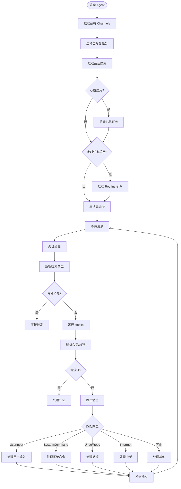

# IronClaw Agent Loop 实现分析

## 项目概述

IronClaw 是一个**安全优先**的个人 AI 助手，使用 Rust 实现，强调数据隐私、WASM 沙箱隔离和多层安全防护。

## 核心架构

### 模块化设计

IronClaw 的 Agent 系统由多个独立模块组成：

```
src/agent/
├── agent_loop.rs      # 主 Agent 循环
├── agentic_loop.rs    # 工具调用循环
├── router.rs          # 消息路由
├── scheduler.rs       # 并行任务调度
├── dispatcher.rs      # 工具分发
├── session_manager.rs # 会话管理
├── routine_engine.rs  # 定时任务引擎
├── heartbeat.rs       # 心跳系统
├── self_repair.rs     # 自动修复
├── cost_guard.rs      # 成本控制
├── compaction.rs      # 上下文压缩
└── ...
```

### Agent 结构

```rust
pub struct Agent {
    pub(super) config: AgentConfig,
    pub(super) deps: AgentDeps,
    pub(super) channels: Arc<ChannelManager>,
    pub(super) context_manager: Arc<ContextManager>,
    pub(super) scheduler: Arc<Scheduler>,
    pub(super) router: Router,
    pub(super) session_manager: Arc<SessionManager>,
    pub(super) context_monitor: ContextMonitor,
    pub(super) heartbeat_config: Option<HeartbeatConfig>,
    pub(super) routine_config: Option<RoutineConfig>,
    pub(super) routine_engine_slot: Arc<RwLock<Option<Arc<RoutineEngine>>>>,
}

pub struct AgentDeps {
    pub owner_id: String,
    pub store: Option<Arc<dyn Database>>,
    pub llm: Arc<dyn LlmProvider>,
    pub cheap_llm: Option<Arc<dyn LlmProvider>>,
    pub safety: Arc<SafetyLayer>,
    pub tools: Arc<ToolRegistry>,
    pub workspace: Option<Arc<Workspace>>,
    pub extension_manager: Option<Arc<ExtensionManager>>,
    pub skill_registry: Option<Arc<RwLock<SkillRegistry>>>,
    pub hooks: Arc<HookRegistry>,
    pub cost_guard: Arc<CostGuard>,
    // ... 更多依赖
}
```

## Agent Loop 实现

### 主循环流程

IronClaw 的主循环位于 `agent_loop.rs`，是一个**事件驱动**的消息处理循环：



### 消息处理流程

`handle_message` 是核心入口：

```rust
async fn handle_message(&self, message: &IncomingMessage) -> Result<Option<String>, Error> {
    // 1. 内部消息检查 - 直接转发，不进入 LLM 循环
    if message.is_internal {
        return Ok(Some(message.content.clone()));
    }
    
    // 2. 设置消息工具上下文
    let target = message.routing_target().unwrap_or_else(|| message.user_id.clone());
    self.tools().set_message_tool_context(Some(message.channel.clone()), Some(target)).await;
    
    // 3. 解析提交类型
    let mut submission = SubmissionParser::parse(&message.content);
    
    // 4. 运行 BeforeInbound Hook
    if let Submission::UserInput { ref content } = submission {
        match self.hooks().run(&HookEvent::Inbound { ... }).await {
            Err(HookError::Rejected { reason }) => return Ok(Some(format!("[Message rejected: {}]", reason))),
            Ok(HookOutcome::Continue { modified: Some(new_content) }) => {
                submission = Submission::UserInput { content: new_content };
            }
            _ => {}
        }
    }
    
    // 5. 水合历史线程
    if let Some(external_thread_id) = message.conversation_scope() {
        self.maybe_hydrate_thread(message, external_thread_id).await?;
    }
    
    // 6. 解析会话和线程
    let (session, thread_id) = self.session_manager.resolve_thread(
        &message.user_id, &message.channel, message.conversation_scope()
    ).await;
    
    // 7. 处理待认证状态
    if let Some(pending) = pending_auth {
        // 处理认证逻辑...
    }
    
    // 8. 检查事件触发的 Routine
    if let Some(engine) = self.routine_engine().await {
        let fired = engine.check_event_triggers(&message.user_id, &message.channel, content).await;
        if fired > 0 {
            return Ok(Some(String::new()));
        }
    }
    
    // 9. 根据提交类型分发处理
    let result = match submission {
        Submission::UserInput { content } => {
            self.process_user_input(message, session, thread_id, &content).await
        }
        Submission::SystemCommand { command, args } => {
            self.handle_system_command(&command, &args, &message.channel).await
        }
        Submission::Undo => self.process_undo(session, thread_id).await,
        Submission::Interrupt => self.process_interrupt(session, thread_id).await,
        // ... 更多类型
    };
    
    // 10. 转换结果并返回
    match result? {
        SubmissionResult::Response { content } => {
            if crate::llm::is_silent_reply(&content) {
                Ok(None)
            } else {
                Ok(Some(content))
            }
        }
        SubmissionResult::NeedApproval { .. } => Ok(Some(String::new())),
        // ... 更多结果类型
    }
}
```

### 工具调用循环 (Agentic Loop)

`run_agentic_loop` 实现了核心的 LLM → Tool → Repeat 循环：

```rust
pub(super) async fn run_agentic_loop(
    &self,
    message: &IncomingMessage,
    session: Arc<Mutex<Session>>,
    thread_id: Uuid,
    initial_messages: Vec<ChatMessage>,
) -> Result<AgenticLoopResult, Error> {
    // 1. 检测群聊
    let is_group_chat = message.metadata.get("chat_type")
        .and_then(|v| v.as_str())
        .is_some_and(|t| t == "group" || t == "channel" || t == "supergroup");
    
    // 2. 加载工作区系统提示（AGENTS.md, SOUL.md 等）
    let system_prompt = if let Some(ws) = self.workspace() {
        ws.system_prompt_for_context_tz(is_group_chat, user_tz).await.ok()
    } else {
        None
    };
    
    // 3. 选择激活的 Skills
    let active_skills = self.select_active_skills(&message.content);
    
    // 4. 构建 Skill 上下文
    let skill_context = build_skill_context(&active_skills);
    
    // 5. 运行工具调用循环
    loop {
        // 调用 LLM
        let response = self.llm().chat(messages.clone(), tools.clone()).await?;
        
        // 检查是否有工具调用
        if response.tool_calls.is_empty() {
            return Ok(AgenticLoopResult::Response(response.content));
        }
        
        // 执行工具调用
        for tool_call in response.tool_calls {
            // 检查是否需要审批
            if needs_approval(&tool_call) {
                return Ok(AgenticLoopResult::NeedApproval { pending });
            }
            
            // 执行工具
            let result = self.tools().execute(&tool_call).await?;
            
            // 添加到消息历史
            messages.push(ChatMessage::tool_result(result));
        }
    }
}
```

## 关键特性

### 1. 并行任务调度

IronClaw 支持**并行任务执行**，由 `Scheduler` 管理：

```rust
pub struct Scheduler {
    config: AgentConfig,
    context_manager: Arc<ContextManager>,
    llm: Arc<dyn LlmProvider>,
    safety: Arc<SafetyLayer>,
    tools: Arc<ToolRegistry>,
    jobs: Arc<RwLock<HashMap<Uuid, ScheduledJob>>>,
    subtasks: Arc<RwLock<HashMap<Uuid, ScheduledSubtask>>>,
}
```

### 2. 自动修复系统

`self_repair.rs` 实现了自动检测和修复卡住的作业：

```rust
// 定期检查卡住的作业
let stuck_jobs = repair.detect_stuck_jobs().await;
for job in stuck_jobs {
    let result = repair.repair_stuck_job(&job).await;
    match result {
        Ok(RepairResult::Success { message }) => { /* 通知成功 */ }
        Ok(RepairResult::Failed { message }) => { /* 通知失败 */ }
        Ok(RepairResult::ManualRequired { message }) => { /* 需要人工干预 */ }
        // ...
    }
}
```

### 3. 心跳系统

后台心跳用于主动监控和维护任务：

```rust
let heartbeat_handle = if let Some(ref hb_config) = self.heartbeat_config {
    if hb_config.enabled {
        Some(spawn_heartbeat(
            config,
            workspace.clone(),
            self.cheap_llm().clone(),
            notify_tx,
            self.store().map(Arc::clone),
        ))
    } else {
        None
    }
} else {
    None
};
```

### 4. 定时任务引擎

支持 Cron 定时、事件触发和 Webhook 处理：

```rust
let engine = Arc::new(RoutineEngine::new(
    rt_config.clone(),
    Arc::clone(store),
    self.llm().clone(),
    Arc::clone(workspace),
    notify_tx,
    Some(self.scheduler.clone()),
    self.tools().clone(),
    self.safety().clone(),
));

// 注册定时任务工具
self.deps.tools.register_routine_tools(Arc::clone(store), Arc::clone(&engine));

// 启动 Cron ticker
let cron_handle = spawn_cron_ticker(Arc::clone(&engine), cron_interval);
```

### 5. WASM 沙箱安全

所有非信任工具在隔离的 WebAssembly 容器中运行：

- **基于能力的权限**：显式启用 HTTP、密钥、工具调用
- **端点白名单**：仅允许批准的主机/路径
- **凭证注入**：在主机边界注入密钥
- **泄漏检测**：扫描请求和响应中的密钥外泄
- **速率限制**：每工具请求限制

## 通道集成

IronClaw 支持多种通道：

| 通道 | 类型 |
|------|------|
| REPL | 交互式 CLI |
| HTTP | Webhook 服务器 |
| WASM Channels | Telegram, Slack 等 |
| Web Gateway | 浏览器 UI (SSE + WebSocket) |

## 总结

IronClaw 的 Agent Loop 设计哲学是 **安全优先、模块化、可扩展**：

| 特点 | 实现方式 |
|------|----------|
| 模块化 | 独立的 router、scheduler、dispatcher |
| 安全性 | WASM 沙箱、凭证保护、注入防御 |
| 可扩展 | 技能系统、扩展管理器、Hook 注册 |
| 可靠性 | 自动修复、心跳、定时任务 |
| 性能 | 并行任务、上下文压缩、廉价 LLM |

其核心优势在于 **企业级安全防护** 和 **可靠的后台自动化**，适合需要高安全性和持续运行的场景。
