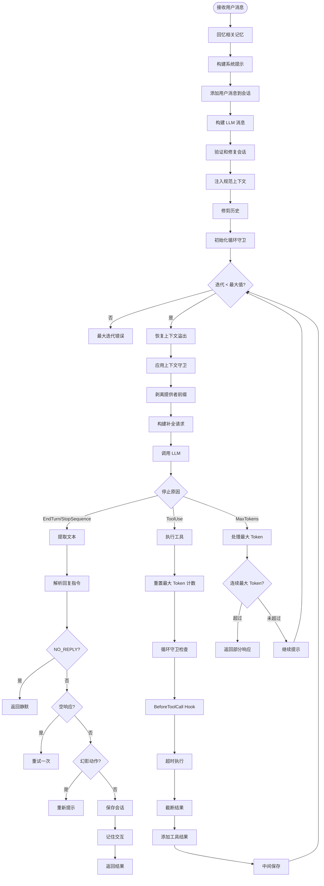

# OpenFang Agent Loop 实现分析

## 项目概述

OpenFang 是一个**自治 Agent 操作系统**，采用 Rust 实现，核心创新是 **Hands（手）**——预构建的自治能力包，可以独立运行、按调度执行，无需用户提示。

## 核心架构

### 模块化设计

OpenFang 由 14 个 Rust crate 组成：

```
openfang-kernel        编排、工作流、计量、RBAC、调度器、预算跟踪
openfang-runtime       Agent 循环、3 个 LLM 驱动、53 个工具、WASM 沙箱、MCP、A2A
openfang-api           140+ REST/WS/SSE 端点、OpenAI 兼容 API、仪表板
openfang-channels      40 个消息适配器
openfang-memory        SQLite 持久化、向量嵌入、规范会话、压缩
openfang-types         核心类型、污染跟踪、Ed25519 清单签名、模型目录
openfang-skills        60 个捆绑技能、SKILL.md 解析器、FangHub 市场
openfang-hands         7 个自治 Hands、HAND.toml 解析器、生命周期管理
openfang-extensions    25 个 MCP 模板、AES-256-GCM 凭证库、OAuth2 PKCE
openfang-wire          OFP P2P 协议、HMAC-SHA256 相互认证
openfang-cli           CLI、守护进程管理、TUI 仪表板、MCP 服务器模式
openfang-desktop       Tauri 2.0 原生应用
openfang-migrate       OpenClaw、LangChain、AutoGPT 迁移引擎
xtask                  构建自动化
```

### Agent 循环核心

`run_agent_loop` 是 OpenFang 的核心函数，位于 `openfang-runtime/src/agent_loop.rs`：

```rust
pub async fn run_agent_loop(
    manifest: &AgentManifest,           // Agent 清单
    user_message: &str,                 // 用户消息
    session: &mut Session,              // 会话状态
    memory: &MemorySubstrate,           // 记忆基质
    driver: Arc<dyn LlmDriver>,         // LLM 驱动
    available_tools: &[ToolDefinition], // 可用工具
    kernel: Option<Arc<dyn KernelHandle>>, // 内核句柄
    skill_registry: Option<&SkillRegistry>, // 技能注册表
    mcp_connections: Option<&Mutex<Vec<McpConnection>>>, // MCP 连接
    web_ctx: Option<&WebToolsContext>,  // Web 工具上下文
    browser_ctx: Option<&BrowserManager>, // 浏览器管理器
    embedding_driver: Option<&(dyn EmbeddingDriver + Send + Sync)>, // 嵌入驱动
    workspace_root: Option<&Path>,      // 工作区根目录
    on_phase: Option<&PhaseCallback>,   // 阶段回调
    media_engine: Option<&MediaEngine>, // 媒体引擎
    tts_engine: Option<&TtsEngine>,     // TTS 引擎
    docker_config: Option<&DockerSandboxConfig>, // Docker 沙箱配置
    hooks: Option<&HookRegistry>,       // Hook 注册表
    context_window_tokens: Option<usize>, // 上下文窗口大小
    process_manager: Option<&ProcessManager>, // 进程管理器
    user_content_blocks: Option<Vec<ContentBlock>>, // 用户内容块
) -> OpenFangResult<AgentLoopResult> {
    // ...
}
```

## Agent Loop 流程

### 核心流程图



### 关键实现细节

#### 1. 记忆回忆

支持向量相似度搜索和文本搜索两种方式：

```rust
let memories = if let Some(emb) = embedding_driver {
    match emb.embed_one(user_message).await {
        Ok(query_vec) => {
            memory.recall_with_embedding_async(
                user_message, 5,
                Some(MemoryFilter { agent_id: Some(session.agent_id), .. }),
                Some(&query_vec),
            ).await.unwrap_or_default()
        }
        Err(e) => {
            // 回退到文本搜索
            memory.recall(user_message, 5, Some(filter)).await.unwrap_or_default()
        }
    }
} else {
    memory.recall(user_message, 5, Some(filter)).await.unwrap_or_default()
};
```

#### 2. 会话修复

自动验证和修复损坏的会话历史：

```rust
// 验证和修复会话历史（删除孤立消息，合并连续消息）
let mut messages = crate::session_repair::validate_and_repair(&llm_messages);

// 在上下文溢出恢复后重新验证
if recovery != RecoveryStage::None {
    messages = crate::session_repair::validate_and_repair(&messages);
}
```

#### 3. 循环守卫 (Loop Guard)

防止工具调用无限循环：

```rust
let loop_guard_config = {
    let mut cfg = LoopGuardConfig::default();
    if max_iterations > cfg.global_circuit_breaker {
        cfg.global_circuit_breaker = max_iterations * 3;
    }
    cfg
};
let mut loop_guard = LoopGuard::new(loop_guard_config);

// 在每个工具调用前检查
let verdict = loop_guard.check(&tool_call.name, &tool_call.input);
match &verdict {
    LoopGuardVerdict::CircuitBreak(msg) => {
        // 触发断路器，终止循环
        return Err(OpenFangError::Internal(msg.clone()));
    }
    LoopGuardVerdict::Block(msg) => {
        // 阻止该工具调用
        tool_result_blocks.push(ContentBlock::ToolResult {
            tool_use_id: tool_call.id.clone(),
            tool_name: tool_call.name.clone(),
            content: msg.clone(),
            is_error: true,
        });
        continue;
    }
    _ => {} // 允许或警告
}
```

#### 4. 幻影动作检测

防止 LLM 声称执行了动作但实际未调用工具：

```rust
fn phantom_action_detected(text: &str) -> bool {
    let lower = text.to_lowercase();
    let action_verbs = ["sent ", "posted ", "emailed ", "delivered ", "forwarded "];
    let channel_refs = [
        "telegram", "whatsapp", "slack", "discord", "email", "channel",
        "message sent", "successfully sent", "has been sent",
    ];
    let has_action = action_verbs.iter().any(|v| lower.contains(v));
    let has_channel = channel_refs.iter().any(|c| lower.contains(c));
    has_action && has_channel
}

// 如果检测到幻影动作，重新提示
if !any_tools_executed && iteration == 0 && phantom_action_detected(&text) {
    messages.push(Message::assistant(text));
    messages.push(Message::user(
        "[System: You claimed to perform an action but did not call any tools. \
         You must use the appropriate tool to actually perform the action.]"
    ));
    continue;
}
```

#### 5. 工具错误指导

当工具调用失败时，注入指导以防止 LLM 虚构结果：

```rust
const TOOL_ERROR_GUIDANCE: &str =
    "[System: One or more tool calls failed. Failed tools did not produce usable data. \
     Do NOT invent missing results, cite nonexistent search results, or pretend failed tools succeeded. \
     If your next steps depend on a failed tool, either retry with a materially different approach \
     or explain the failure to the user and stop.]";

fn append_tool_error_guidance(tool_result_blocks: &mut Vec<ContentBlock>) {
    let has_tool_error = tool_result_blocks
        .iter()
        .any(|block| matches!(block, ContentBlock::ToolResult { is_error: true, .. }));
    if has_tool_error {
        tool_result_blocks.push(ContentBlock::Text {
            text: TOOL_ERROR_GUIDANCE.to_string(),
            provider_metadata: None,
        });
    }
}
```

#### 6. LLM 重试机制

支持自动重试和断路器：

```rust
async fn call_with_retry(
    driver: &dyn LlmDriver,
    request: CompletionRequest,
    provider: Option<&str>,
    cooldown: Option<&ProviderCooldown>,
) -> OpenFangResult<CompletionResponse> {
    // 检查断路器
    if let (Some(provider), Some(cooldown)) = (provider, cooldown) {
        match cooldown.check(provider) {
            CooldownVerdict::Reject { reason, retry_after_secs } => {
                return Err(OpenFangError::LlmDriver(format!(
                    "Provider '{provider}' is in cooldown ({reason}). Retry in {retry_after_secs}s."
                )));
            }
            _ => {}
        }
    }
    
    // 重试循环
    for attempt in 0..=MAX_RETRIES {
        match driver.complete(request.clone()).await {
            Ok(response) => {
                if let (Some(provider), Some(cooldown)) = (provider, cooldown) {
                    cooldown.record_success(provider);
                }
                return Ok(response);
            }
            Err(LlmError::RateLimited { retry_after_ms }) => {
                if attempt == MAX_RETRIES {
                    return Err(OpenFangError::LlmDriver(format!("Rate limited after {} retries", MAX_RETRIES)));
                }
                let delay = std::cmp::max(retry_after_ms, BASE_RETRY_DELAY_MS * 2u64.pow(attempt));
                tokio::time::sleep(Duration::from_millis(delay)).await;
            }
            Err(LlmError::Overloaded { retry_after_ms }) => {
                // 类似处理...
            }
            Err(e) => {
                // 使用分类器进行智能错误处理
                let classified = llm_errors::classify_error(&e.to_string(), status);
                return Err(OpenFangError::LlmDriver(classified.sanitized_message));
            }
        }
    }
    
    Err(OpenFangError::LlmDriver(last_error.unwrap_or_else(|| "Unknown error".to_string())))
}
```

#### 7. 流式支持

支持流式输出：

```rust
pub async fn run_agent_loop_streaming(
    // ... 参数与 run_agent_loop 相同
    tx: mpsc::Sender<StreamEvent>, // 流事件发送器
) -> OpenFangResult<AgentLoopResult> {
    // 使用 stream_with_retry 替代 call_with_retry
    let response = stream_with_retry(&*driver, request, tx, provider, cooldown).await?;
    // ...
}
```

#### 8. Hook 系统

支持在关键点注入自定义逻辑：

```rust
// BeforePromptBuild Hook
if let Some(hook_reg) = hooks {
    let ctx = HookContext {
        agent_name: &manifest.name,
        agent_id: &agent_id_str,
        event: HookEvent::BeforePromptBuild,
        data: serde_json::json!({
            "system_prompt": &manifest.model.system_prompt,
            "user_message": user_message,
        }),
    };
    let _ = hook_reg.fire(&ctx);
}

// BeforeToolCall Hook（可阻止执行）
if let Some(hook_reg) = hooks {
    let ctx = HookContext {
        agent_name: &manifest.name,
        agent_id: &caller_id_str,
        event: HookEvent::BeforeToolCall,
        data: serde_json::json!({
            "tool_name": &tool_call.name,
            "input": &tool_call.input,
        }),
    };
    if let Err(reason) = hook_reg.fire(&ctx) {
        tool_result_blocks.push(ContentBlock::ToolResult {
            tool_use_id: tool_call.id.clone(),
            tool_name: tool_call.name.clone(),
            content: format!("Hook blocked tool '{}': {}", tool_call.name, reason),
            is_error: true,
        });
        continue;
    }
}

// AgentLoopEnd Hook
if let Some(hook_reg) = hooks {
    let ctx = HookContext {
        agent_name: &manifest.name,
        agent_id: &agent_id_str,
        event: HookEvent::AgentLoopEnd,
        data: serde_json::json!({
            "iterations": iteration + 1,
            "response_length": final_response.len(),
        }),
    };
    let _ = hook_reg.fire(&ctx);
}
```

## Hands 系统

OpenFang 的核心创新是 **Hands**——预构建的自治能力包：

| Hand | 功能 |
|------|------|
| **Clip** | YouTube 视频剪辑、字幕、缩略图 |
| **Lead** | 每日潜在客户发现、评分、交付 |
| **Collector** | OSINT 情报、变更检测、知识图谱 |
| **Predictor** | 超级预测引擎、校准推理链 |
| **Researcher** | 深度自主研究、交叉验证、APA 引用 |
| **Twitter** | 自主 Twitter/X 账户管理 |
| **Browser** | Web 自动化代理 |

每个 Hand 包含：
- **HAND.toml**：清单文件，声明工具、设置、要求
- **系统提示**：多阶段操作手册（500+ 字）
- **SKILL.md**：领域专业知识参考
- **护栏**：敏感操作的审批门

## 安全特性（16 层）

| # | 系统 | 功能 |
|---|------|------|
| 1 | WASM 双计量沙箱 | 燃料计量 + 纪元中断 |
| 2 | Merkle 哈希链审计跟踪 | 密码学链接的不可变日志 |
| 3 | 信息流污染跟踪 | 密钥从源到汇的跟踪 |
| 4 | Ed25519 签名 Agent 清单 | 密码学签名的身份和能力 |
| 5 | SSRF 保护 | 阻止私有 IP 和云元数据端点 |
| 6 | 密钥零化 | `Zeroizing<String>` 自动擦除 |
| 7 | OFP 相互认证 | HMAC-SHA256 随机数验证 |
| 8 | 能力门 | 基于角色的访问控制 |
| 9 | 安全头 | CSP、X-Frame-Options、HSTS |
| 10 | 健康端点编辑 | 公开端点最小信息 |
| 11 | 子进程沙箱 | `env_clear()` + 选择性变量传递 |
| 12 | 提示注入扫描器 | 检测覆盖尝试和数据外泄 |
| 13 | 循环守卫 | SHA256 工具调用循环检测 |
| 14 | 会话修复 | 7 阶段消息历史验证 |
| 15 | 路径遍历预防 | 规范化 + 符号链接转义预防 |
| 16 | GCRA 速率限制器 | 成本感知令牌桶 |

## 总结

OpenFang 的 Agent Loop 设计哲学是 **自治、安全、全面**：

| 特点 | 实现方式 |
|------|----------|
| 自治 | Hands 系统、定时执行、事件触发 |
| 安全 | 16 层安全防护、WASM 沙箱、审计跟踪 |
| 全面 | 53 个内置工具、40 个通道适配器 |
| 可靠 | 循环守卫、会话修复、幻影动作检测 |
| 流式 | 实时输出、阶段回调 |

其核心优势在于 **完全自治的能力** 和 **企业级安全防护**，适合需要 24/7 自动化运营的场景。
